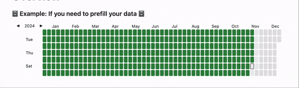

# Heatmap Tracker plugin for Obsidian

## Watch video to start using this plugin in 30 seconds

In Progress...


## Start with this code example
> **Tip:** Replace `trackerData` with your own dataset to visualize custom data points.

> **Tip:** Add `dataviewjs` in the beginning of your code block to enable DataviewJS functionality.

```javascript
// Update this object
const trackerData = {
    entries: [],
    separateMonths: true,
    heatmapTitle: "This is the title for your heatmap",
    heatmapSubtitle: "This is the subtitle for your heatmap. You can use it as a description."
}

// Path to the folder with notes
const PATH_TO_YOUR_FOLDER = "daily notes preview/notes";
// Name of the parameter you want to see on this heatmap
const PARAMETER_NAME = 'steps';

// You need dataviewjs plugin to get information from your pages
for(let page of dv.pages(`"${PATH_TO_YOUR_FOLDER}"`).where((p) => p[PARAMETER_NAME])){
    trackerData.entries.push({
        date: page.file.name,
        intensity: page[PARAMETER_NAME],
        content: await dv.span(`[](${page.file.name})`)
    });
}

renderHeatmapTracker(this.container, trackerData);
```


The **Heatmap Tracker** plugin is a versatile and visually appealing tool for tracking data over a calendar year. This plugin empowers you to create beautiful heatmaps for various purposes, such as habit tracking, project progress, or data visualization directly within Obsidian. Below is a comprehensive overview of its features, usage, and development opportunities.


This plugin is useful for tracking progress for exercise, finances, social time, project progression, passions, learning progress and so on.   

To be used with [Obsidian Dataview](https://blacksmithgu.github.io/obsidian-dataview/), but could be used standalone or with other plugins as well (if you know some javascript).


## 📦 Plugin Features

### ✅ Key Features:
1. **Yearly Heatmap Visualization**  
   Render a dynamic heatmap for the selected year, displaying data intensity for each day.
   
2. **Customizable Colors and Intensity**  
   Define your own color schemes and intensity ranges to match your data's theme.

3. **Interactive Navigation**  
   Easily switch between years using left and right navigation arrows.

4. **Flexible Data Entries**  
   Add entries with customizable colors, intensity levels, and tooltips for detailed content.

5. **Monthly Separation Option**  
   Choose whether to separate months visually within the heatmap.

6. **Current Day Highlight**  
   Optionally display a border around the current day for easy identification.


### Preview of Heatmap Tracker component




## 📖 How to use

1. Annotate the data you want to track in your daily notes (see [Dataview annotation documentation](https://blacksmithgu.github.io/obsidian-dataview/data-annotation/)) 

2. Create a [DataviewJS block](https://blacksmithgu.github.io/obsidian-dataview/api/intro/) where you want the Heatmap Tracker to display.  

3. Collect the data you want to display using [DataviewJS](https://blacksmithgu.github.io/obsidian-dataview/api/code-reference/)

4. Pass the data into Heatmap Tracker using  **renderHeatmapTracker()** 


## Development (Windows/Mac):

 ```npm run dev``` - will start an automatic TS to JS transpiler and automatically copy the generated JS/CSS/manifest files to the example vault when modified (Remember to run ```npm install``` first).

 After the files have been transpiled, the **hot-reload plugin** (https://github.com/pjeby/hot-reload) then reloads Obsidian automatically.
 Hot-reload is installed in the example vault by default. its used to avoid restarting obsidian after every change to code.  
 *(remember to add an empty *.hotreload* file to "EXAMPLE_VAULT/.obsidian/plugins/heatmap-tracker/" if not already present, as this tells hot-reload to watch for changes)*


```npm run build``` generates the files ready for distribution.

&nbsp;

Tip: ```ctrl-shift-i``` opens the devtools inside Obsidian.

&nbsp;


## Technical Explanation
All the plugin does, is add the function ***renderHeatmapTracker()*** to the global namespace of you vault.

**"this.container"** is passed as the first argument because the plugin needs to know where to render the tracker. You don't have to worry about this.

"renderHeatmapTracker()" then takes **"trackerData"** as the secondary argument. This is the javascript object you have to create yourself in order to give plugin instructions and data. Most of the properties are optional, but you have to supply an entries array as an absolute minimum.  

See the beginning of the readme for the full code example.

### Absolute minimum code example:
~~~javascript
\```dataviewjs

const trackerData = {
    entries: [],                
}

renderHeatmapTracker(this.container, trackerData)

```
~~~

## Changelog

All notable changes to this project will be documented in this file.

The format is based on [Keep a Changelog](https://keepachangelog.com/en/1.0.0/), 
and this project adheres to [Semantic Versioning](https://semver.org/).

---

### [1.1.5] - 2024-11-30
#### 🔄 Changed
- Update README.md.

---

### [1.1.4] - 2024-11-30
#### 🐛 Fixed
- Remove min-width.

---

### [1.1.3] - 2024-11-30
#### 🐛 Fixed
- Fix styles for mobile devices.

---

### [1.1.2] - 2024-11-30
#### 🔄 Changed
- Since now heatmap tracker is scrollable. It will be displayed better on mobile devices.
- The form of boxes in the heatmap has been changed. Now they are more square.
- In separate months mode empty spaces between months are not hoverable anymore.

#### ❌ Removed
- Removed old documentation.

---

### [1.1.1] - 2024-11-30
#### ✨ Added
- Add title for the heatmap: `heatmapTitle`.
- Add subtitle for the heatmap: `heatmapSubtitle`.

---

### [1.1.0] - 2024-11-30
#### ✨ Added
- I migrated this plugin to React. This will make it easier to maintain and add new features in the future.
- I started to translate this plugin and added three languages: English, German and Russian. Plugin is not fully translated yet.

#### 🐛 Fixed
- Fixed issues related to NaN.

#### ❌ Removed
- Removed manual rendering implementation.

---

### [1.0.0] - 2024-11-29
#### ✨ Added
- This is the initial release of Heatmap Tracker plugin for Obsidian.
- Plugin is released and available for use.

---

### [Version X.Y.Z] - YYYY-MM-DD
#### ✨ Added
- *(New features or enhancements introduced in this release.)*

#### 🔄 Changed
- *(Modifications to existing features or behavior.)*

#### 🐛 Fixed
- *(Bugs or issues resolved in this release.)*

#### ❌ Removed
- *(Deprecated or removed features.)*

---

## Inspired by:
https://github.com/Richardsl/heatmap-calendar-obsidian