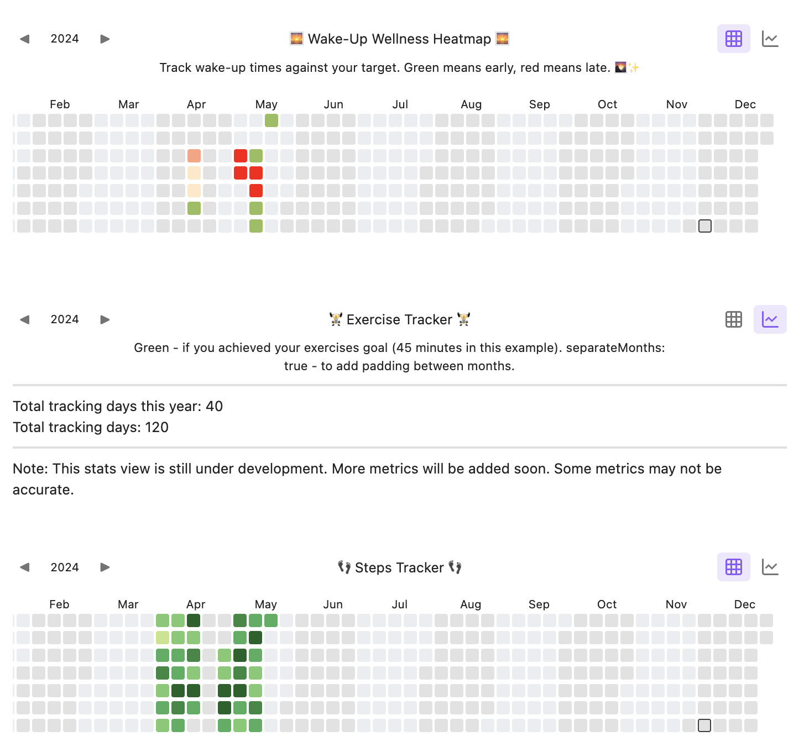
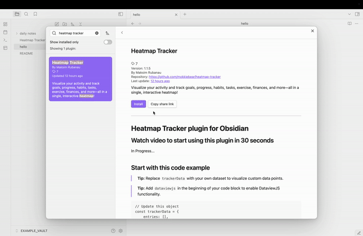
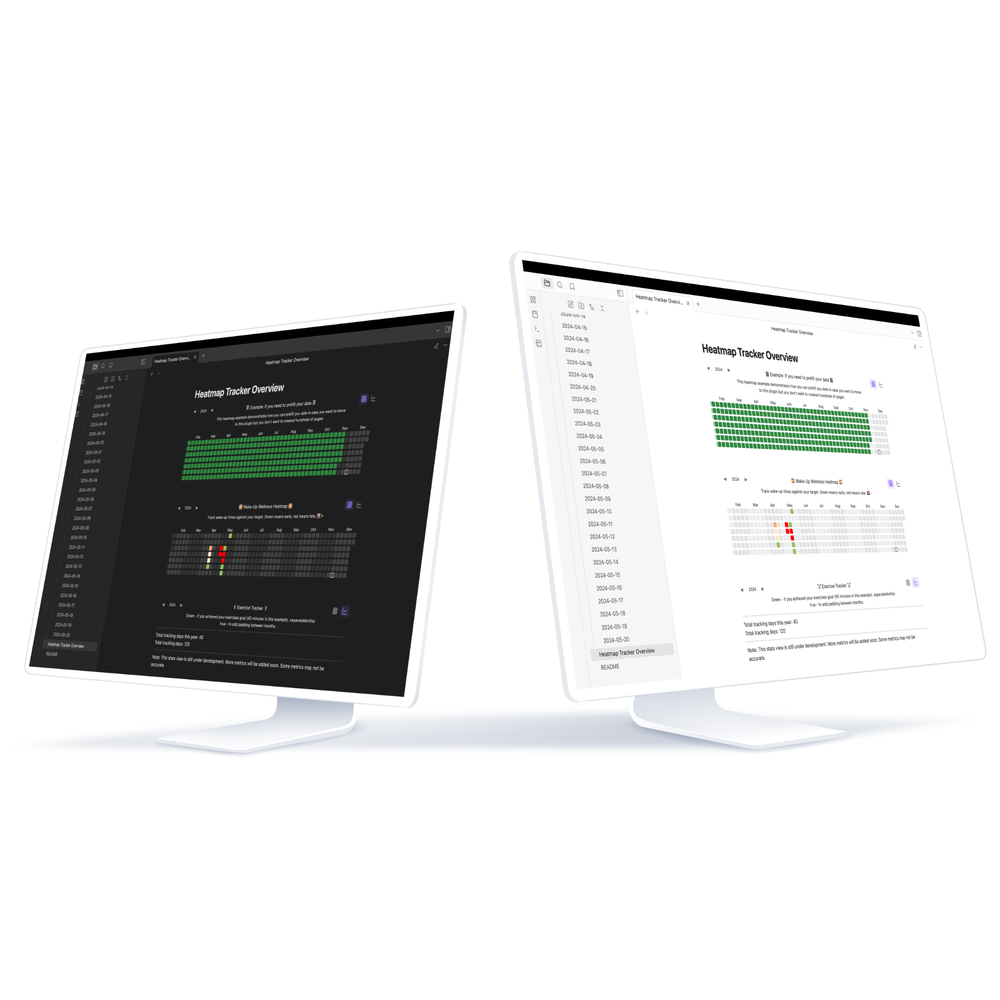
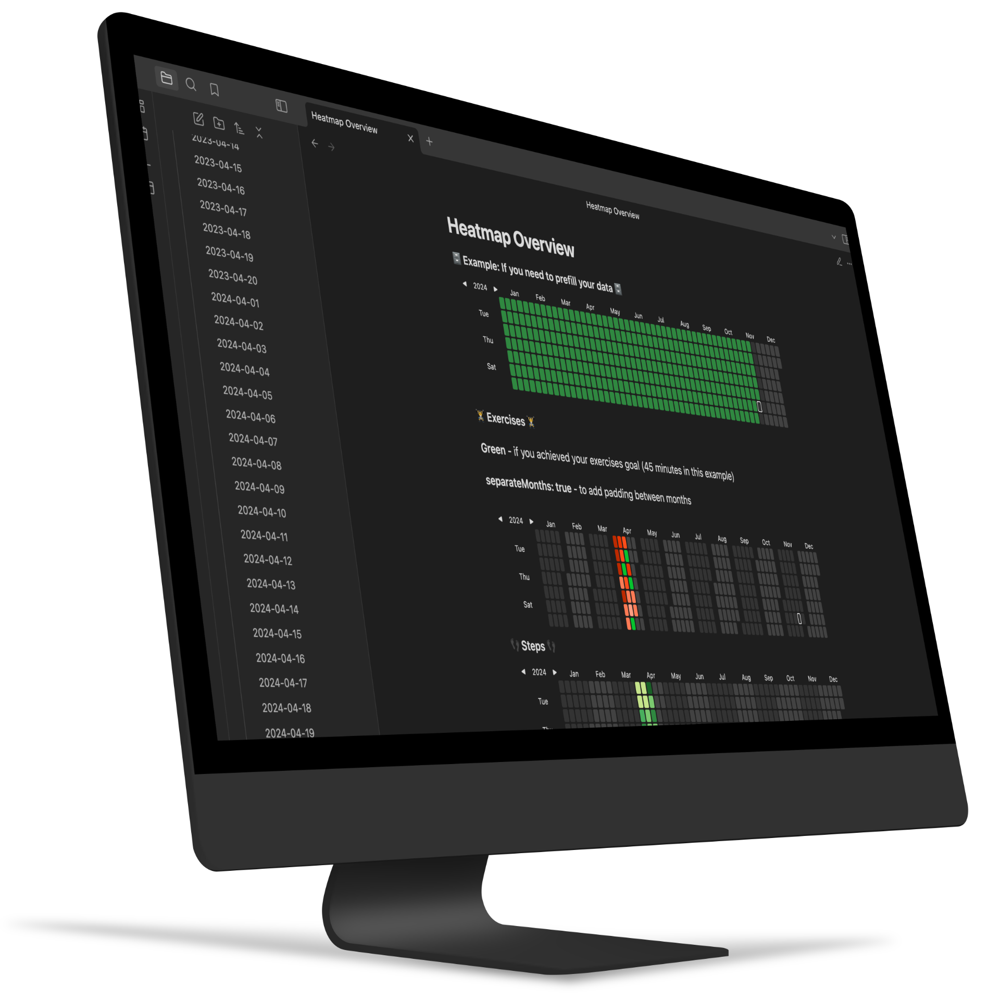

# Heatmap Tracker plugin for Obsidian



The **Heatmap Tracker plugin for Obsidian** is a powerful and customizable tool designed to help you **track, visualize, and analyze data** over a calendar year. Perfect for habit tracking, project management, personal development, or any kind of data visualization, this plugin enables you to create beautiful, interactive heatmaps directly within Obsidian. Whether you’re **monitoring progress, visualizing trends, or staying on top of daily goals**, the Heatmap Tracker enhances your productivity and organization. Discover its intuitive features, flexible customization options, and seamless integration with Obsidian in the detailed guide below.

## Watch video to start using this plugin in 30 seconds




## Start with this code example
> **Tip:** Replace `trackerData` with your own dataset to visualize custom data points.

> **Tip:** Add `dataviewjs` in the beginning of your code block to enable DataviewJS functionality.

```javascript
// Update this object
const trackerData = {
    entries: [],
    separateMonths: true,
    heatmapTitle: "This is the title for your heatmap",
    heatmapSubtitle: "This is the subtitle for your heatmap. You can use it as a description.",
}

// Path to the folder with notes
const PATH_TO_YOUR_FOLDER = "daily notes preview/notes";
// Name of the parameter you want to see on this heatmap
const PARAMETER_NAME = 'steps';

// You need dataviewjs plugin to get information from your pages
for(let page of dv.pages(`"${PATH_TO_YOUR_FOLDER}"`).where((p) => p[PARAMETER_NAME])){
    trackerData.entries.push({
        date: page.file.name,
        intensity: page[PARAMETER_NAME],
        content: await dv.span(`[](${page.file.name})`)
    });
}

renderHeatmapTracker(this.container, trackerData);
```

## Tracker Settings Documentation

### `year`
- **Type:** `number`
- **Default:** Current year (`new Date().getFullYear()`)
- **Description:** Specifies the year for which the heatmap should display data by default.

---

### `colors`
- **Type:** `object`
- **Default:**
```
{
  "default": ["#c6e48b", "#7bc96f", "#49af5d", "#2e8840", "#196127"]
}
```
- **Description:** Defines the color scale used for representing different intensity levels in the heatmap. Each color corresponds to a specific range of data intensity.

---

### `entries`
- **Type:** `array`
- **Default:**
```
[
  { "date": "1900-01-01", "color": "#7bc96f", "intensity": 5, "content": "" }
]
```
- **Description:** A list of data entries for the heatmap. Each entry includes:
  - `date`: The date of the entry (ISO string format).
  - `color`: The color for that entry.
  - `intensity`: The data intensity for that date.
  - `content`: Optional tooltip or note associated with the date.

---

### `showCurrentDayBorder`
- **Type:** `boolean`
- **Default:** `true`
- **Description:** Indicates whether the current day should be highlighted with a border on the heatmap.

---

### `defaultEntryIntensity`
- **Type:** `number`
- **Default:** `4`
- **Description:** The default intensity assigned to new data entries if no intensity is explicitly specified.

---

### `intensityScaleStart`
- **Type:** `number`
- **Default:** `1`
- **Description:** The minimum value for the intensity scale. Used to determine the color mapping for the lowest intensity values in the heatmap.

---

### `intensityScaleEnd`
- **Type:** `number`
- **Default:** `5`
- **Description:** The maximum value for the intensity scale. Represents the highest possible intensity that can be mapped to the color scale.

---

### `weekStartDay`
- **Type:** `number`
- **Default:** `1`
- **Description:** Specifies the first day of the week. Values correspond to:
  - `0`: Sunday
  - `1`: Monday
  - `2`: Tuesday, and so on.

---

### `separateMonths`
- **Type:** `boolean`
- **Default:** `false`
- **Description:** Determines whether months should be visually separated within the heatmap layout.




To be used with [Obsidian Dataview](https://blacksmithgu.github.io/obsidian-dataview/), but could be used standalone or with other plugins as well (if you know some javascript).


## 📦 Plugin Features

### ✅ Key Features:
1. **Yearly Heatmap Visualization**  
   Render a dynamic heatmap for the selected year, displaying data intensity for each day.
   
2. **Customizable Colors and Intensity**  
   Define your own color schemes and intensity ranges to match your data's theme.

3. **Interactive Navigation**  
   Easily switch between years using left and right navigation arrows.

4. **Flexible Data Entries**  
   Add entries with customizable colors, intensity levels, and tooltips for detailed content.

5. **Monthly Separation Option**  
   Choose whether to separate months visually within the heatmap.

6. **Localization**  
   Plugin supports multiple languages, including English, German and Russian.




## Development (Windows/Mac):

 ```npm run dev``` - will start an automatic TS to JS transpiler and automatically copy the generated JS/CSS/manifest files to the example vault when modified (Remember to run ```npm install``` first).

 After the files have been transpiled, the **hot-reload plugin** (https://github.com/pjeby/hot-reload) then reloads Obsidian automatically.
 Hot-reload is installed in the example vault by default. its used to avoid restarting obsidian after every change to code.  
 *(remember to add an empty *.hotreload* file to "EXAMPLE_VAULT/.obsidian/plugins/heatmap-tracker/" if not already present, as this tells hot-reload to watch for changes)*


```npm run build``` generates the files ready for distribution.

&nbsp;

Tip: ```ctrl-shift-i``` opens the devtools inside Obsidian.

&nbsp;


## Technical Explanation
All the plugin does, is add the function ***renderHeatmapTracker()*** to the global namespace of you vault.

**"this.container"** is passed as the first argument because the plugin needs to know where to render the tracker. You don't have to worry about this.

"renderHeatmapTracker()" then takes **"trackerData"** as the secondary argument. This is the javascript object you have to create yourself in order to give plugin instructions and data. Most of the properties are optional, but you have to supply an entries array as an absolute minimum.  

See the beginning of the readme for the full code example.

---

## Inspired by:
https://github.com/Richardsl/heatmap-calendar-obsidian